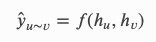
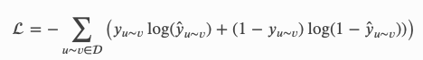

# 链路预测

在介绍中，您已经学习了使用 GNN 进行节点分类的基本工作流程，即预测图中节点的类别。 本教程将教您如何训练 GNN 进行链接预测，即预测图中两个任意节点之间是否存在边。

在本教程结束时，您将能够

+ 构建基于 GNN 的链接预测模型。
+ 在 DGL 提供的小型数据集上训练和评估模型。

（时间估计：28 分钟）

```python
import dgl
import torch
import torch.nn as nn
import torch.nn.functional as F
import itertools
import numpy as np
import scipy.sparse as sp
```


## GNN 链接预测概述

许多应用，如社交推荐、商品推荐、知识图补全等，都可以表述为链接预测，即预测两个特定节点之间是否存在边。 本教程展示了一个示例，用于预测引文网络中是否存在两篇论文之间的引文关系，无论是被引还是被引。

本教程将链接预测问题表述为二元分类问题，如下所示：

+ 将图中的边视为正例。
+ 采样一些不存在的边（即它们之间没有边的节点对）作为反例。
+ 将正例和负例分成训练集和测试集。
+ 使用任何二元分类指标评估模型，例如曲线下面积 (AUC)。

Note

> 实践来自 [SEAL](https://papers.nips.cc/paper/2018/file/53f0d7c537d99b3824f0f99d62ea2428-Paper.pdf)，尽管这里的模型没有使用他们的节点标记思想。

在某些领域，例如大规模推荐系统或信息检索，您可能更喜欢强调 top-K 预测的良好性能的指标。 在这些情况下，您可能需要考虑其他指标（例如平均精度），并使用其他负采样方法，这超出了本教程的范围。

## 加载图和特征

在[介绍](https://docs.dgl.ai/tutorials/blitz/1_introduction.html)之后，本教程首先加载 Cora 数据集。

```python
import dgl.data

dataset = dgl.data.CoraGraphDataset()
g = dataset[0]
```

Out:

```
  NumNodes: 2708
  NumEdges: 10556
  NumFeats: 1433
  NumClasses: 7
  NumTrainingSamples: 140
  NumValidationSamples: 500
  NumTestSamples: 1000
Done loading data from cached files.
```

## 准备训练和测试集

本教程随机选取 10% 的边作为测试集中的正例，其余的留给训练集。 然后它为两组中的负样本采样相同数量的边。

```python
# Split edge set for training and testing
u, v = g.edges()

eids = np.arange(g.number_of_edges())
eids = np.random.permutation(eids)
test_size = int(len(eids) * 0.1)
train_size = g.number_of_edges() - test_size
test_pos_u, test_pos_v = u[eids[:test_size]], v[eids[:test_size]]
train_pos_u, train_pos_v = u[eids[test_size:]], v[eids[test_size:]]

# Find all negative edges and split them for training and testing
adj = sp.coo_matrix((np.ones(len(u)), (u.numpy(), v.numpy())))
adj_neg = 1 - adj.todense() - np.eye(g.number_of_nodes())
neg_u, neg_v = np.where(adj_neg != 0)

neg_eids = np.random.choice(len(neg_u), g.number_of_edges())
test_neg_u, test_neg_v = neg_u[neg_eids[:test_size]], neg_v[neg_eids[:test_size]]
train_neg_u, train_neg_v = neg_u[neg_eids[train_size:]], neg_v[neg_eids[train_size:]]
```

训练时，您需要从原始图中删除测试集中的边。 您可以通过 `dgl.remove_edges` 执行此操作。

Note:

> `dgl.remove_edges `的工作原理是从原始图创建一个子图，产生一个副本，因此对于大图来说可能会很慢。 如果是这样，您可以将训练和测试图保存到磁盘，就像预处理一样。

```python
train_g = dgl.remove_edges(g, eids[:test_size])
```

## 定义一个 GraphSAGE 模型

本教程构建了一个由两个 `GraphSAGE `层组成的模型，每个层通过平均邻居信息来计算新的节点表示。 DGL 提供了 `dgl.nn.SAGEConv `可以方便地创建一个 `GraphSAGE` 层。

```python
from dgl.nn import SAGEConv

# ----------- 2. create model -------------- #
# build a two-layer GraphSAGE model
class GraphSAGE(nn.Module):
    def __init__(self, in_feats, h_feats):
        super(GraphSAGE, self).__init__()
        self.conv1 = SAGEConv(in_feats, h_feats, 'mean')
        self.conv2 = SAGEConv(h_feats, h_feats, 'mean')

    def forward(self, g, in_feat):
        h = self.conv1(g, in_feat)
        h = F.relu(h)
        h = self.conv2(g, h)
        return h
```

然后，该模型通过函数（例如 MLP 或点积）计算两个事件节点的表示之间的分数来预测边存在的概率，您将在下一节中看到。



## Positive graph, negative graph, and `apply_edges`

在之前的教程中，您已经学习了如何使用 GNN 计算节点表示。 但是，链接预测要求您计算节点对的表示。

DGL 建议您将节点对视为另一个图，因为您可以用边来描述一对节点。 在链接预测中，您将拥有一个由所有正示例作为边组成的正图，以及一个由所有负示例组成的负图。 正图和负图将包含与原始图相同的节点集。 这使得在多个图形之间传递节点特征进行计算变得更加容易。 正如您稍后将看到的，您可以直接将在整个图上计算的节点表示提供给正负图，以计算成对分数。

下面的代码分别为训练集和测试集构造正图和负图。

```python
train_pos_g = dgl.graph((train_pos_u, train_pos_v), num_nodes=g.number_of_nodes())
train_neg_g = dgl.graph((train_neg_u, train_neg_v), num_nodes=g.number_of_nodes())

test_pos_g = dgl.graph((test_pos_u, test_pos_v), num_nodes=g.number_of_nodes())
test_neg_g = dgl.graph((test_neg_u, test_neg_v), num_nodes=g.number_of_nodes())
```

将节点对视为图的好处是您可以使用 `DGLGraph.apply_edges` 方法，该方法可以根据事件节点的特征和原始边特征（如果适用）方便地计算新的边特征。

DGL 提供了一组优化的内置函数来基于原始节点/边特征计算新的边特征。 例如，`dgl.function.u_dot_v` 计算每个边的事件节点表示的点积。

```python
import dgl.function as fn

class DotPredictor(nn.Module):
    def forward(self, g, h):
        with g.local_scope():
            g.ndata['h'] = h
            # Compute a new edge feature named 'score' by a dot-product between the
            # source node feature 'h' and destination node feature 'h'.
            g.apply_edges(fn.u_dot_v('h', 'h', 'score'))
            # u_dot_v returns a 1-element vector for each edge so you need to squeeze it.
            return g.edata['score'][:, 0]
```

如果函数很复杂，您也可以编写自己的函数。 例如，以下模块通过连接事件节点的特征并将其传递给 MLP，在每条边上生成标量分数。

```python
class MLPPredictor(nn.Module):
    def __init__(self, h_feats):
        super().__init__()
        self.W1 = nn.Linear(h_feats * 2, h_feats)
        self.W2 = nn.Linear(h_feats, 1)

    def apply_edges(self, edges):
        """
        Computes a scalar score for each edge of the given graph.

        Parameters
        ----------
        edges :
            Has three members ``src``, ``dst`` and ``data``, each of
            which is a dictionary representing the features of the
            source nodes, the destination nodes, and the edges
            themselves.

        Returns
        -------
        dict
            A dictionary of new edge features.
        """
        h = torch.cat([edges.src['h'], edges.dst['h']], 1)
        return {'score': self.W2(F.relu(self.W1(h))).squeeze(1)}

    def forward(self, g, h):
        with g.local_scope():
            g.ndata['h'] = h
            g.apply_edges(self.apply_edges)
            return g.edata['score']
```

Note:

> 内置函数针对速度和内存进行了优化。 我们建议尽可能使用内置函数。

Note:

>  如果您已阅读[消息传递教程](https://docs.dgl.ai/tutorials/blitz/3_message_passing.html)，您会注意到 `apply_edges `的参数与 `update_all `中的消息函数具有完全相同的形式。

## 训练

定义节点表示计算和边得分计算后，您可以继续定义整体模型、损失函数和评估指标。

损失函数只是二元交叉熵损失。



本教程中的评估指标是 AUC。

```python
model = GraphSAGE(train_g.ndata['feat'].shape[1], 16)
# You can replace DotPredictor with MLPPredictor.
#pred = MLPPredictor(16)
pred = DotPredictor()

def compute_loss(pos_score, neg_score):
    scores = torch.cat([pos_score, neg_score])
    labels = torch.cat([torch.ones(pos_score.shape[0]), torch.zeros(neg_score.shape[0])])
    return F.binary_cross_entropy_with_logits(scores, labels)

def compute_auc(pos_score, neg_score):
    scores = torch.cat([pos_score, neg_score]).numpy()
    labels = torch.cat(
        [torch.ones(pos_score.shape[0]), torch.zeros(neg_score.shape[0])]).numpy()
    return roc_auc_score(labels, scores)
```

训练循环如下：

Note:

> 本教程不包括对验证集的评估。 在实践中，您应该根据验证集的性能保存和评估最佳模型。

```python
# ----------- 3. set up loss and optimizer -------------- #
# in this case, loss will in training loop
optimizer = torch.optim.Adam(itertools.chain(model.parameters(), pred.parameters()), lr=0.01)

# ----------- 4. training -------------------------------- #
all_logits = []
for e in range(100):
    # forward
    h = model(train_g, train_g.ndata['feat'])
    pos_score = pred(train_pos_g, h)
    neg_score = pred(train_neg_g, h)
    loss = compute_loss(pos_score, neg_score)

    # backward
    optimizer.zero_grad()
    loss.backward()
    optimizer.step()

    if e % 5 == 0:
        print('In epoch {}, loss: {}'.format(e, loss))

# ----------- 5. check results ------------------------ #
from sklearn.metrics import roc_auc_score
with torch.no_grad():
    pos_score = pred(test_pos_g, h)
    neg_score = pred(test_neg_g, h)
    print('AUC', compute_auc(pos_score, neg_score))


# Thumbnail credits: Link Prediction with Neo4j, Mark Needham
# sphinx_gallery_thumbnail_path = '_static/blitz_4_link_predict.png'
```

Out:

```
In epoch 0, loss: 0.6919783353805542
In epoch 5, loss: 0.35678067803382874
In epoch 10, loss: 0.3167201578617096
In epoch 15, loss: 0.34004080295562744
In epoch 20, loss: 0.31848058104515076
In epoch 25, loss: 0.30114394426345825
In epoch 30, loss: 0.30263105034828186
In epoch 35, loss: 0.2935180366039276
In epoch 40, loss: 0.2860472500324249
In epoch 45, loss: 0.2817786633968353
In epoch 50, loss: 0.27566981315612793
In epoch 55, loss: 0.2684997022151947
In epoch 60, loss: 0.2612987756729126
In epoch 65, loss: 0.25356653332710266
In epoch 70, loss: 0.24488452076911926
In epoch 75, loss: 0.23467616736888885
In epoch 80, loss: 0.22140082716941833
In epoch 85, loss: 0.20260605216026306
In epoch 90, loss: 0.1767767369747162
In epoch 95, loss: 0.1496562361717224
AUC 0.8016464140517958
```

## 代码

https://docs.dgl.ai/_downloads/b08e2ce136f11d6adce9c983b726bd76/4_link_predict.py

https://docs.dgl.ai/_downloads/744b0cbc719549ccbe981c589a9e6227/4_link_predict.ipynb

